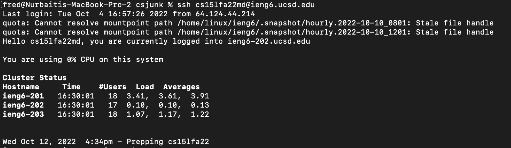
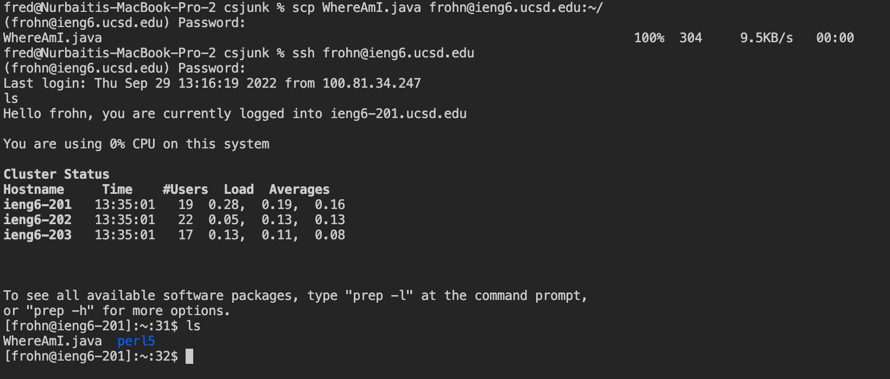
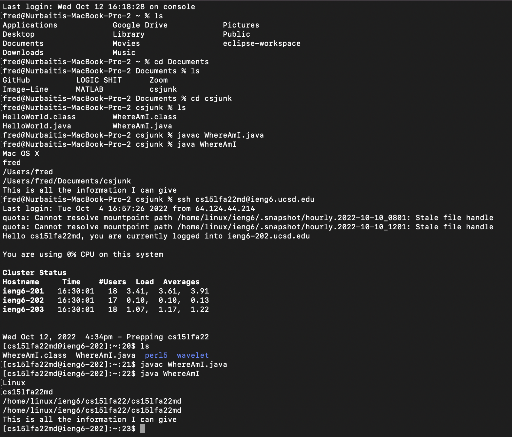
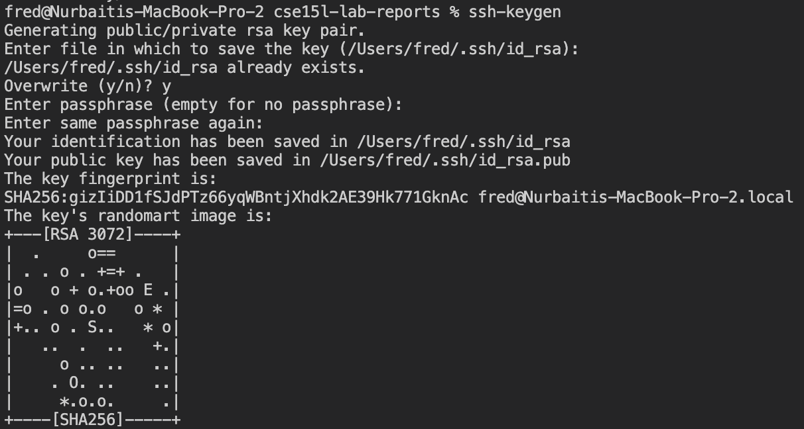
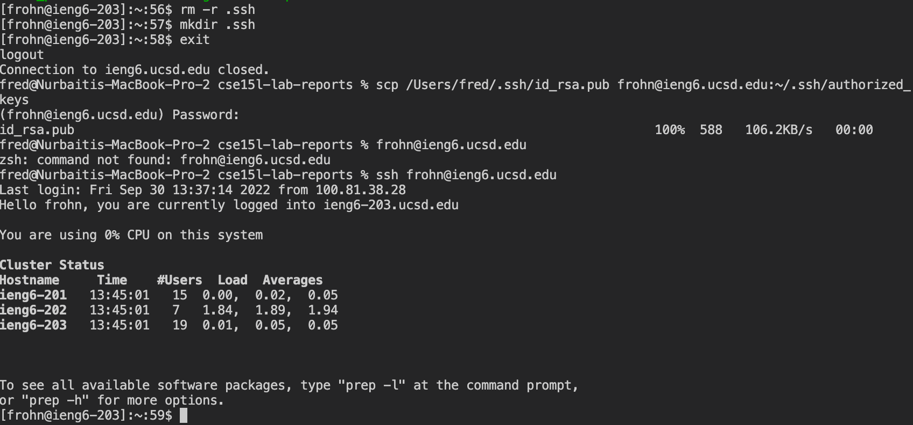
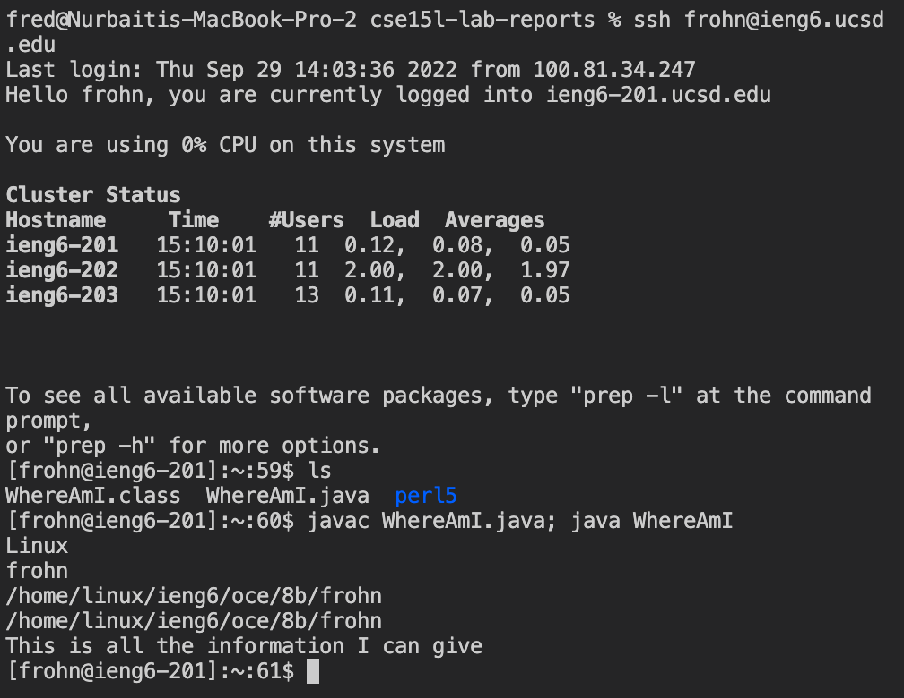

# LAB REPORT WEEK 1

This week we learned how to download VSCODE, accessing a remote server, running basic commands, moving files, setting a key, and optimizing remote running. 

 I initially used my email account, and then redid all of it using my cs15lfa22md@ieng6@ucsd.edu once I figured out how to get access. Although I redid everything completely, I only included relevant screenshots from the redo that added value to the tutorial. 

## Downloading VS Code

To Download VS Code, you simply need to search it up on the internet. The first link is the VS Code website, and the download button is in the upper right corner. 

If you're too lazy to do that, here's the link: 

[Link to VSCODE](https://code.visualstudio.com/)

When you download VS Code and open it up, it should look like this:


## Accessing a remote Server

To connect to a remote server, type ssh and the name of the server like below:

`$ ssh cs15lfa22md@ieng6.ucsd.edu`

It's going to ask for a password, which you should know. In my case, it did not prompt me to write yes or no. I couldn't log into that server so I used my email address instead. 

This is what it should look like: 


Now you are on the remote server. To exit, type: 

`$ exit`

When I figured out how to get access to the other account, here's what the ssh looked like. By the time I screenshotted it, I had already set up the public key, so it didn't ask me for a password. 

Here's what that looked like: 



## Running Commands

Some basic commands to try are
`$ cd <directory>`, which let's you change directory. 

`$ ls`, which lets you see what folders and files exist in the current directory

`$ cat <file>`, which prints everything 

Here is what it should look like if you run commands on the server I accessed in the previous step: 

*Note: I forgot to take this screenshot and retook it after completing the steps below, that is why you can see the WhereAmI.java file.*


## Moving Files Using scp

The first thing I did was create a WhereAmI.java file, that is filled with this code: 
```
class WhereAmI {
  public static void main(String[] args) {
    System.out.println(System.getProperty("os.name"));
    System.out.println(System.getProperty("user.name"));
    System.out.println(System.getProperty("user.home"));
    System.out.println(System.getProperty("user.dir"));
  }
}
```

To move it into the remote server, you have to type this code: 
`$ scp WhereAmI.java frohn@ieng6.ucsd.edu:~/`

It will prompt you to type in the same password you used to access the server, and after that, it's done. 

Once its in the server, you can access the file by using SSH and then if you use the ls command you should see the file. You can compile and run it by using: 

```
javac WhereAmI.java
java WhereAmI
```
This is what it should look like: 




After redoing what I just mentioned above but with the cs15lfa22md@ieng6.ucsd.edu account, I compiled and ran WhereAmI.java on both the local and remote server so you can see the difference:



If you pay attention to what WhereAmI prints out, you can see that I'm in a different directory, which shows that the file has been moved. 

## Setting up an SSH Key

To set up an SSH key, which speeds up login, type:
`$ ssh-keygen`
It will ask you which file you want to save the key for. Click enter. 

I already had setup a keygen, but forgot to screenshot, so I did it again. I had an extra prompt that asked me whether or not I wanted to overwrite. I did. 

Then, I entered my passphrase. 

This is what that looks like: 


After that, I used ssh to access the remote server and used the following commands to delete and remake the .ssh directory, and logout
```
$ rm -r .ssh
$ mkdir .ssh
$ exit
```

Although this is what I did, you shouldn't do this becasue the .ssh file may contain things you don't know about. Next time, just reuse the server. When I redid this and set up the SSH key in my cs15lfa22md@ieng6.ucsd.edu account, I didn't run into this problem because I did it all at once. In the "Accessing a Remote Server Section", I left a screenshot of me SSHing into the account without it asking for a password, which shows that the key is set up.

From there, you use scp to move the passkey from your computer into that remote directory with this command: 

`/Users/fred/.ssh/id_rsa.pub frohn@ieng6.ucsd.edu:~/.ssh/authorized_
keys`

It will prompt you for a password, and then you are done. 

After that, you can use your passphrase. 

After setting it up, I tried it out. Here's the whole process: 



## Making Remote Running Easier

There are little things you can do to make editing, exporting, and running code easier. For example, you can use the up and down arrows to reuse commands that you've already done, you can add semicolons between commands to run multiple at once, and you can ssh and type a command in parantheses to run it and immedietely exit. 

This is what running multiple commands at once would look like: 



