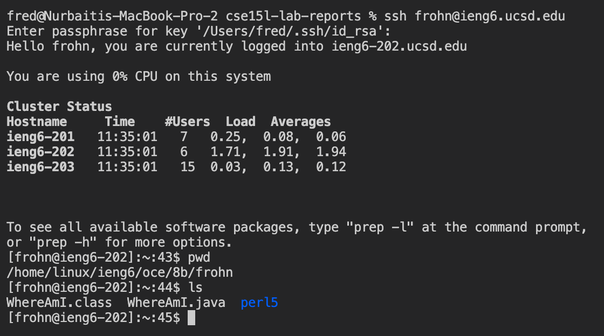

# LAB REPORT WEEK 1

This week we learned how to download VSCODE, accessing a remote server, running basic commands, moving files, setting a key, and optimizing remote running. 

## Downloading VS Code

To Download VS Code, you simply need to search it up on the internet. The first link is the VS Code website, and the download button is in the upper right corner. When you download VS Code and open it up, it should look like this:

## Accessing a remote Server

To connect to a remote server, type ssh and the name of the server like below:

`$ ssh cs15l@ieng6@ucsd.edu`

It's going to ask for a password, which you should know. In my case, it did not prompt me to write yes or no. I couldn't log into that server so I used my email address instead. 

*Self note: The KEY for my remote server has not been setup because I only did it for my email account*

This is what it should look like: 

Now you are on the remote server. To exit, type: 

`$ exit`

## Running Commands

Some basic commands to try are
`$ cd <directory>`, which let's you change directory. 

`$ ls`, which lets you see what folders and files exist in the current directory

`$ cat <file>`, which prints everything 

Here is what it should look like if you run commands on the server I accessed in the previous step: 

*Note: I forgot to take this screenshot and retook it after completing the steps below, that is why you can see the WhereAmI.java file.*

