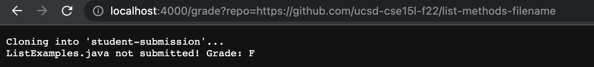
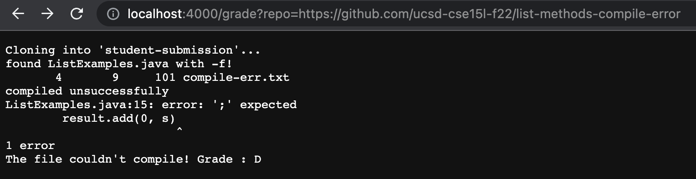
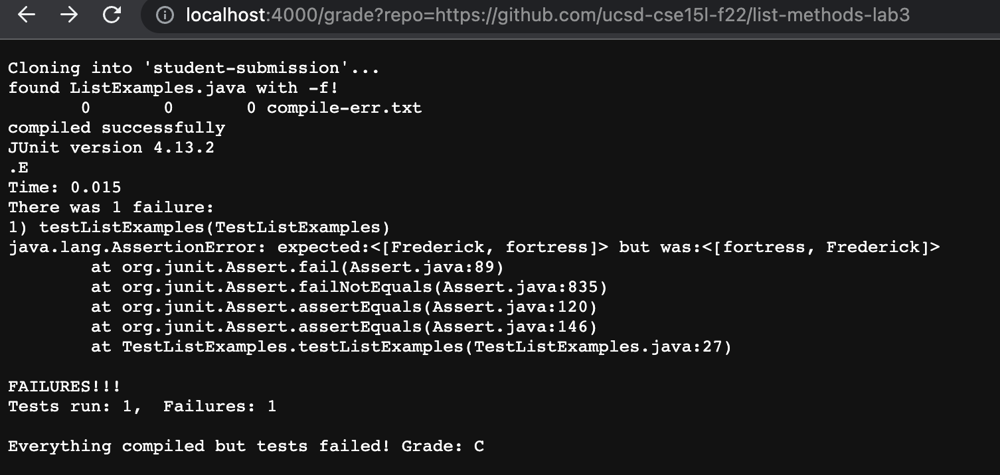
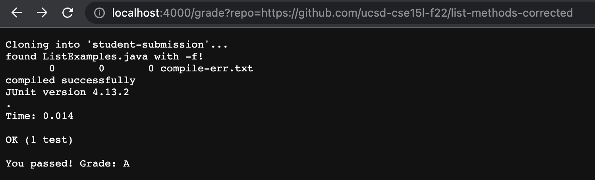

## Lab Report 5 Week 9

This week we learned how to use scripting to build an "autograder".

## The grade.sh file

This is the bash script that I used as the autograder: 

```
# Create your grading script here

# set -e

CPATH=".:lib/hamcrest-core-1.3.jar:lib/junit-4.13.2.jar"

rm -rf student-submission
git clone $1 student-submission

if [[ -f student-submission/ListExamples.java ]]
then
    echo "found ListExamples.java with -f!"
else
    echo "ListExamples.java not submitted! Grade: F"
    exit 2
fi

cp TestListExamples.java student-submission
cp -R lib student-submission
cd student-submission

javac -cp $CPATH *.java 2> compile-err.txt

wc compile-err.txt

#-s checks if file is not empty
if [[ -s compile-err.txt ]]
then
    echo "compiled unsuccessfully"
    cat compile-err.txt
    echo "The file couldn't compile! Grade : D"
    exit 2
else 
    echo "compiled successfully"
fi


java -cp $CPATH org.junit.runner.JUnitCore TestListExamples > out.txt

cat out.txt


#Credits: https://github.com/Kylehtran/cse15l_Lab7_autograder
fails=$(head -n 2 out.txt | tail -n 1 | grep -o "E" | wc -l)
tests=$(head -n 2 out.txt | tail -n 1 | grep -o "." | wc -l)

if [[ $fails -eq 0 ]]
then 
    echo "You passed! Grade: A"
else 
    echo "Everything compiled but tests failed! Grade: C"
fi
```

Here are four screenshots of four examples of me using the autograder in the browser, each with a different outcome. 


Here, the person who submitted wrote a good implemementation but didn't call the file ListExamples.java. My autograder leaves a message that lets the person know that they never submitted a ListExamples.java file. Since there wasn't even anything to grade, the person gets an F. 



Here, the person submitted a ListExamples.java file, but it didn't compile properly. There is an error message due to this compile error which is printed so that the person knows what went wrong. At the bottom, the autograder leaves a message that tells the person that their file didn't compile. Since they did at least submit the correct file, the autograder gave them a slightly better grade than the person who did not submit the file at all, a D. 



Here, the person submitted the correct file, and it compiled. However, they did not pass all the tests. So, the autograder gives him a better score, but not a good score, a C. The autograder also outputs the JUnit message to let the person know how they did in the tests. The autograder also leaves a message that says that their file compiled but did not pass the tests. 



Here, the person submitted a correctly working ListExamples.java file. Thus, the autograder leaves a message that says that the person passed all tests, and gives the person an A. The JUnit message is still outputted so the person has another form of reassurance. 

The most interesting example is the 3rd example, the example where the person failed the tests. So I will trace through what grade.sh does to produce the output that it does. 

So the first thing that happens in grade.sh is the variable setting. I create a variable called CPATH which just stores the JUnit classpath as a String that I can later use to make the code more efficient. 

The first command is `rm -rf student-submission`. This deletes `student-submission` in the current directory if it exists. This command is simply a safety to ensure that we don't create hundreds of duplicates in the same file everytime we run the bash script. In this case, there is no standard or error output. The return code for this command is 0.

The second command is `git clone $1 student-submission`. What this does is clone the repository from the link provided as the first parameter passed through after the command in the terminal into a directory called `student-submission`. For example, in this case, `$1` is `https://github.com/ucsd-cse15l-f22/list-methods-lab3`. In the web browswer, that would be the part of the URL that is after the equal sign. There is no error output. The standard output is the first line of the screenshot of the browser, `Cloning into 'student-submission' ...` The return code for this would be 0 since it works fine.  

Now we arrive at the first if statement. `if [[ -f student-submission/ListExamples.java ]]` checks whether or not a `ListExamples.java` file exists within `student-submission`. In this case, ListExamples.java does exist, it's true, so `echo "found ListExamples.java with -f!"` runs. `found ListExamples.java with -f!` is also the standard output, and is the second line of the screenshot. There is no error output in this case. The return code is 0. If it didn't exist, `echo "ListExamples.java not submitted! Grade: F" exit 2` would've been triggered. `ListExamples.java not submitted! Grade: F` would've been the standard output, the grade given would've been F, naturally, and the return code would've been 2. There is no error output. 

Now, we arrive at these three commands. `cp TestListExamples.java student-submission`
, `cp -R lib student-submission`
, `cd student-submission`. For all of these, there is no standard output nor is there an error output. In all cases, the return code is 0. the cp copies TestListExamples.java into student-submission and cp -R copies the lib directory into student-submission so that JUnit is usable. cd changes our current directory to student-submission. It isn't neccessary, but just makes the rest of the code easier to manage. 

This next command is interesting. `javac -cp $CPATH *.java 2> compile-err.txt`, compiles all java files in the current directory. If there is a compile error, there is an error output that gets put into a newly created file called compile-err.txt. In this case, that doesn't happen so there is no standard output or error output. The return code is 0 and the script moves forth. 

The next Command is wc compile-err.txt. The standard output of this command is the third line of the screenshot, ` 0 0 0 compile-err.txt`. There is no error output and the return code is 0. 

Now we are at the next if statement. `if [[ -s compile-err.txt ]]` checks if `compile-err.txt` is not empty. If it wasn't, `echo "compiled unsuccessfully"`, `cat compile-err.txt`, `echo "The file couldn't compile! Grade : D"`, `exit 2` would've been triggered. This branch doens't run. Instead, `echo "compiled successfully"` runs. The standard output is `compiled successfully`, which is the next line in the screenshot. The return code is 0. 

Next, `java -cp $CPATH org.junit.runner.JUnitCore TestListExamples > out.txt` runs. This runs the TestListExamples file using JUnit and puts the standard output into out.txt. There is no error output. The return code is 0. 

`cat out.txt` simply prints out the contents of the out.txt file. That printed content is the standard output of this command. There is no error output, and the return code is 0. This is the main block of the output in the browswer. Everything from `JUnit...` to `Failures: 1` is because of this single command. This shows the person who used my grader what JUnit prints, and tells them what they did wrong or right. This submission had something wrong with his code, which is why you see all the comments about the failures like `FAILURES!!!`. The return code is 0. 

`fails=$(head -n 2 out.txt | tail -n 1 | grep -o "E" | wc -l)` and 
`tests=$(head -n 2 out.txt | tail -n 1 | grep -o "." | wc -l)` are variable assignments that use commands on out.txt to figure out how many passed and failed tests occur. This is the standard output of the java run was redirected into a seperate file. head -n 2 out.txt outputs the first two lines of out.txt while tail -n 1 takes the last line of that output, grep -o "E" and grep -o "." look for E and ., and wc -l counts how many times E and . occur. From the bigger picture, it looks at the second line of the java run output and sees how many Es and .s are printed, which is JUnits way of telling you how many tests ran and failed. In this case, tests turns out to be 1 and fails turns out to be 1. 

The last if statement is `if [[ $fails -eq 0 ]]`, which checks whether or not fails is 0. Fails isn't zero, its false, so `echo "You passed! Grade: A"` is not triggered. Instead, `echo "Everything compiled but tests failed! Grade: C"` is triggered. The standard output is `Everything compiled but tests failed! Grade: C`, a grade of C is given because not all tests were passed. There is no error output and the return code is 0. A more elaborate grader would take the difference between the tests ran and failed to determine the grade, but this is still enough to give good feedback to the person who submitted. 


