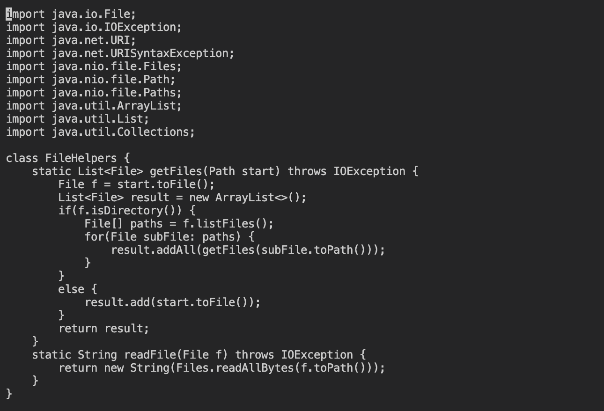
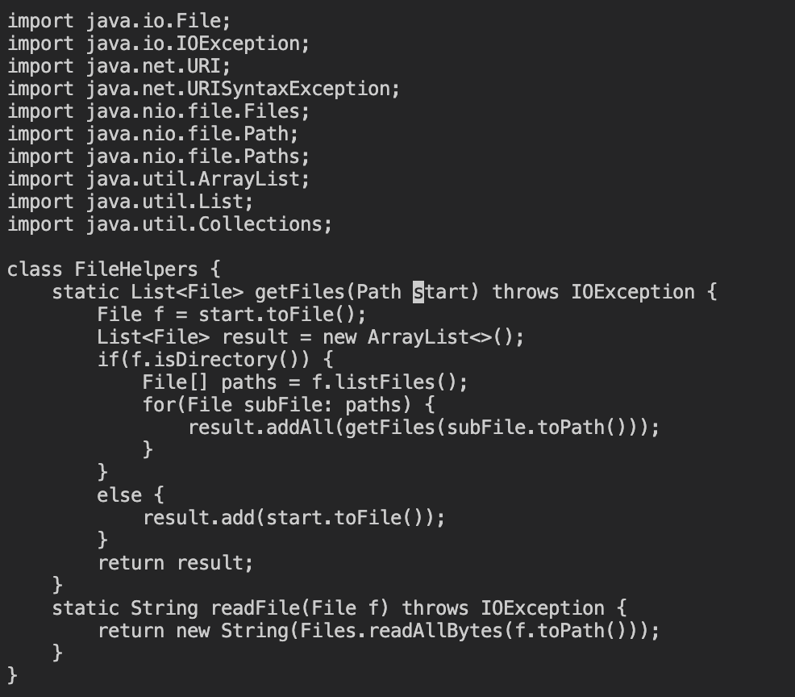
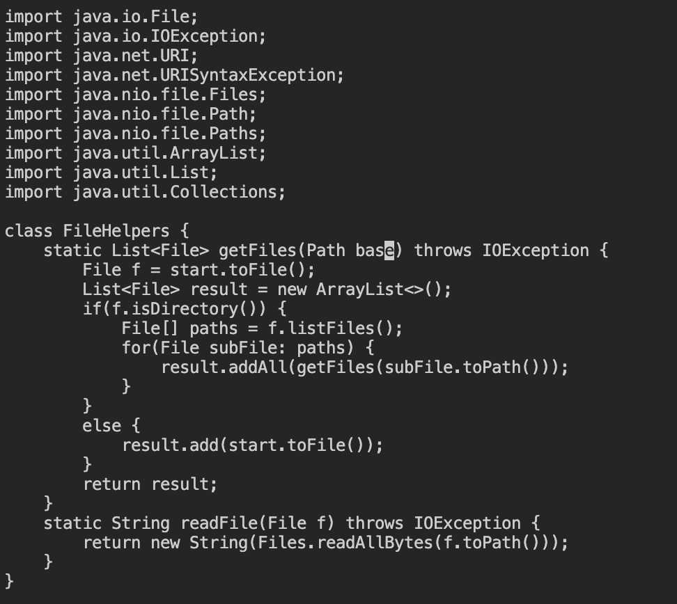
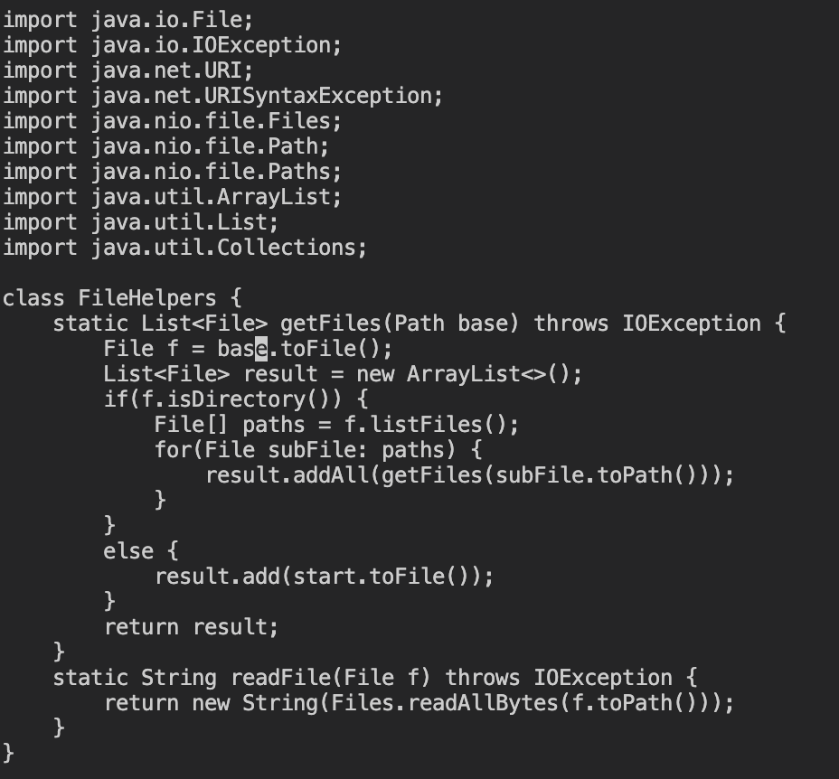
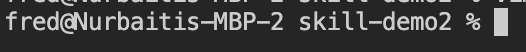

# Lab Report Week 7

This week we learned how to use VIM

## Part 1

The keystrokes needed to change all the start paramater in getFiles() in DocSearchServer.java are as follows: 

`/start<enter>cebase<esc>n.n.:wq`

Here is an in-depth step through of the process.

To enter vim, go into the `/skill-demo2` directory, then type `$ vim DocSearchServer.java`. That bring you to this page: 

The cursor begins in the top left, and you begin in the command mode. 

Now, type `/start<enter>`. That takes you here: 

the `/` command lets you search for an instance of whatever you type after it, and moves the cursor there. In this case, that would be the word `start`. The keypress `<enter>` tells vim that you are done typing and executes the command. As you can see, the cursor is now at the first instance of `start` below where the cursor originally was. 

Now, type `cebase<esc>`. That takes you here: 

The `ce` command deletes the word and puts you into insert mode so you can replace it with something new. `base` is the word we are replacing start with. the `<esc>` keypress takes you back to the command mode. 

From here, type `n.`. This is where you land once you do that the first time: 

the `n` command takes you to the next instance of the word that you searched, and the `.` command repeats the last command you just did. So, now the cursor is right what was the next instance of the `start` that had just changed to `base`. There is another instance of start so I repeated set of commands another time. 

Then, type `:wq`. This takes you to this page: 

.

the :wq command saves changes and exits vim. 

## Part 2

When I used vim to edit `DocSearchServer.java` in the remote server and do what I just did, it took me under a minute. When I tried scp the edited file, I made the mistake of using `scp -r` to move the directory. That took at least 5 minutes. Yes, I should've just moved the file directly into the remote directory, but even then, just moving around vscode, the terminal, finding where the file is stored locally and remotely, all takes much longer than just using vim remotely. 

Which of these two styles would you prefer using if you had to work on a program that you were running remotely, and why?

If the program was mostly finished and I was making small edits, I'd use vim so that I wouldn't have to go through the trouble of figuring out where it is on either server. However, if there was a lot of work to be done, I'd work on it locally in an editor I'm comfortable with, and then scp it once I'm finished. 

What about the project or task might factor into your decision one way or another? (If nothing would affect your decision, say so and why!)

That's about it. It depends how much I have left to do. If its not much, vim, if it's mostly not built and/or I don't know what I even need to do, the visuals of vsCode are much easier to navigate for me. The extensions I've added don't hurt either. 

